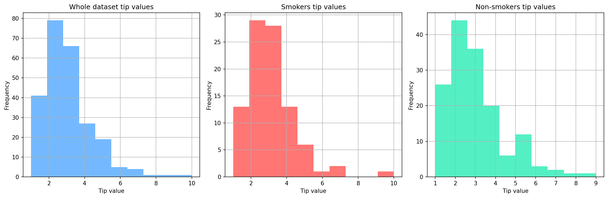

# Project Title: Restaurant-tips-analysis 
This is a excercise focuses on exploring and analyzing tipping behavior in a restaurant setting using Python. The analysis aims to identify patterns and differences in tip amounts based on customer characteristics such as smoking status and gender, using descriptive statistics and data visualization techniques.
# A description of the data
## Source of the Data
The dataset is the Tips Dataset, originally from the seaborn library, which is commonly used for data analysis and visualization practice.
## Description of the Dataset
The dataset contains information about restaurant bills and tips, including:
  + `total_bill`: Total bill amount (USD)
  + `tip`: Tip amount given by the customer (USD)
  + `sex`: Gender of the customer (Male/Female)
  + `smoker`: Smoking status (Yes/No)
  + `day`: Day of the week
  + `time`: Time of day (Lunch/Dinner)
  + `size`: Size of the dining party
The primary variable of interest in this project is **`tip`**, which represents customer tipping behavior.
## How to Access the Data
Import pandas library and matplotlib library in python
```Python
import pandas as pd
import matplotlib.pyplot as plt
```
Upload dataset
```Python
df= pd.read_csv("https://raw.githubusercontent.com/RusAbk/sca_datasets/main/tips.csv")
```
A brief overview of the dataset
|    |   id |   total_bill |   tip | sex    | smoker   | day   | time   |   size |
|---:|-----:|-------------:|------:|:-------|:---------|:------|:-------|-------:|
|  0 |    0 |        16.99 |  1.01 | Female | No       | Sun   | Dinner |      2 |
|  1 |    1 |        10.34 |  1.66 | Male   | No       | Sun   | Dinner |      3 |
|  2 |    2 |        21.01 |  3.5  | Male   | No       | Sun   | Dinner |      3 |
|  3 |    3 |        23.68 |  3.31 | Male   | No       | Sun   | Dinner |      2 |
|  4 |    4 |        24.59 |  3.61 | Female | No       | Sun   | Dinner |      4 |
# Main Goals
Explore the distribution of tip amounts
Compare tipping behavior between:
  + Smokers vs. Non-smokers
  + Male vs. Female customers
Analyze differences in:
  + Central tendency (mean, median)
  + Distribution shape and variability
# Result
## Smokers vs. Non-smokers
|        |   Common |   Smokers |   Non-smokers |
|:-------|---------:|----------:|--------------:|
| min    |  1       |   1       |       1       |
| max    | 10       |  10       |       9       |
| mean   |  2.99828 |   3.00871 |       2.99185 |
| median |  2.9     |   3       |       2.74    |
### Insights based on measures of central tendency comparison:
1. Min of all groups is 1
2. Max of Non-smokers (9) < Smokers (10)
3. Average of Smokers group is the highest, the difference isn't significant compared to the other group.
4. Median of Smokers group is the highest,the distribution of Non-smokers is skewed towards lower values

**General conclusion:** Smokers Group tend to tip more than Non-smokers group

**<p align="center">Tip Distribution by Smoking Status**



**Insights based on distribution comparison:**
1. The joint distribution of the Smoker tip value is strongly right-skewed
2. Sudden appearance of high tip values (6–10) => Average of Smokers group is the highest
3. In the Non-smoker group, most tips are in the range of 1 - 4


**General conclusion:** The tip distribution is right-skewed across all groups. Smokers show a wider spread and more extreme high tip values

## Male vs. Female customer
|        |     male |   female |
|:-------|---------:|---------:|
| min    |  1       |  1       |
| max    | 10       |  6.5     |
| mean   |  3.08962 |  2.83345 |
| median |  3       |  2.75    |
### Insights based on measures of central tendency comparison:
1. Min of all groups is 1
2. Max of male (10) > female (6.5), there is a large difference between the two maximum values.
3. Average of male group is higher than average of female group
4. Median male group is higher than average of female group


**General conclusion:** Male tend to tip value slightly higher than female.

**<p align="center">Tip Distribution by Gender Status**


**Insights based on distribution comparison:**
1. Male Group: The joint distribution of tip value is strongly right-skewed, many tip values >5 and outliers appear
2. Female Group: The joint distribution of tip value is slightly right-skewed, most tip value are in the range of 1 – 4

**General conclusion:** Male tend to tip higher in special cases Female tip more consistently


